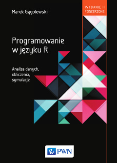

# Programowanie w języku R (2016) — Wydanie 2

Autor:
[Marek Gągolewski](https://www.gagolewski.com),

Wydawca:
Wydawnictwo Naukowe PWN

Liczba stron:
550

Wydanie:
2 poszerzone

ISBN:
978-83-01-18939-6

[Link do księgarni PWN](http://ksiegarnia.pwn.pl/Programowanie-w-jezyku-R,647767533,p.html)

Zobacz też: 

* [Przetwarzanie i analiza danych w języku Python](https://github.com/gagolews/Analiza_danych_w_jezyku_Python).
* [Minimalist Data Wrangling with Python](https://datawranglingpy.gagolewski.com/)

# Materiały uzupełniające

Treści zawarte w niniejszym repozytorium
udostępnione są zgodnie z zasadami otwartej licencji BSD-2-clause
i stanowią materiał uzupełniający do książki.

> Otwarte i wolnodostępne środowisko R zyskało w ostatnich latach ogromną
> popularność. Język R jest jednym z podstawowych narzędzi w warsztacie wielu
> analityków danych, statystyków, *data scientists*, badaczy opinii i rynku,
> specjalistów *business intelligence* czy naukowców.

> Większość publikacji dostępnych na polskim i zagranicznym rynku wydawniczym
> skupia się na omawianiu sposobów wykorzystania środowiska R w różnych
> zastosowaniach praktycznych, m.in. w ekonomii, medycynie, bioinformatyce,
> psychologii, socjologii oraz naukach technicznych. Objaśnia zatem sposób
> korzystania z szablonowych rozwiązań na zasadzie „kucharskich przepisów”.
> Ta oto książka stawia sobie jednak za cel wsparcie Czytelnika w jego drodze
> ku programistycznej samodzielności – aby mógł wyjść poza gotowe schematy
> i śmiało mierzyć się z nowymi wyzwaniami, przed jakimi stawia nas
> tzw. era informacji.

> Książka skupia się na dogłębnym wyjaśnieniu zasad funkcjonowania środowiska R.
> Nie można jej jednak nazwać po prostu kursem programowania, a to dlatego, że R
> jest ściśle związany z bogatymi obszarami swoich zastosowań. Czytelnik dowie
> się więc, w jaki sposób przeprowadzać w R obliczenia symulacyjne i numeryczne,
> jak implementować algorytmy przetwarzania danych, pobierać, tworzyć
> i przygotowywać zbiory danych do analizy, automatyzować bardzo
> żmudne – gdyby je wykonywać ręcznie – zadania czy też tworzyć raporty,
> tabele i wykresy.

## Co nowego w drugim wydaniu?

Pierwsze wydanie *Programowania w języku R* zostało przygotowane w 2013
r. W ukazującym się po 3 latach drugim wydaniu zaszedł szereg istotnych
zmian --- wszystkie partie tekstu zostały zrewidowane, a wiele z nich
nawet zostało przepisanych od nowa. Do najbardziej zauważalnych różnic
możemy zaliczyć:

-   uproszczenie materiału przedstawianego na początku każdego rozdziału
    --- trudniejsze partie zostały przesunięte zgodnie z duchem „od
    ogółu do szczegółu";

-   dodanie kilkuset ćwiczeń (wraz z rozwiązaniami) do tekstu głównego;

-   zamieszczenie większej liczby przykładów z analizy danych (opis
    implementacji wielu ważnych metod maszynowego uczenia się, więcej
    uwagi poświęconej ramkom danych);

-   nowy rozdział na temat integracji C++ z R (coraz więcej pakietów
    jest tworzona przy użyciu `Rcpp`, co bardzo pozytywnie wpłynęło w
    ostatnich latach na szeroko pojętą jakość tego rodzaju dodatków);

-   omówienie pakietu `stringi` w rozdziale na temat przetwarzania
    napisów;

-   przesunięcie rozdziału nt. pętli jak najdalej, jak to było możliwe;

-   opis sposobów dostępu do baz danych SQL, przetwarzania plików JSON i
    XML oraz technik wydobywania informacji ze stron internetowych (ang.
    *web scraping*);

-   złączenie dwóch rozdziałów na temat generowania grafiki w jeden;

-   opis języka Markdown w rozdz. na temat generowania dynamicznych
    raportów;

-   bardziej dokładne omówienie sposobów tworzenia pakietów i poprawy
    szeroko pojętej jakości kodu;

-   bardziej przystępne omówienie mechanizmów niestandardowej ewaluacji
    i jej znaczenia.

## Poglądowy spis treści

1. Środowisko R i program RStudio

2. Typy atomowe: wektory i NULL

3. Operacje na wektorach

4. Listy

5. Funkcje

6. Atrybuty obiektów

7. Typy złożone

8. Pielęgnowanie kodu

9. Modyfikacja przepływu sterowania

10. Przetwarzanie napisów

11. Przetwarzanie plików

12. Tworzenie wykresów

13. Generowanie raportów przy użyciu pakietu knitr

14. Obliczenia numeryczne

15. Symulacje

16. Zarządzenie środowiskiem R

17. Środowiska

18. Syntaktyka i semantyka języka R

19. Programowanie zorientowane obiektowo

20. Integracja R i C++ przy użyciu pakietu Rcpp

. Bibliografia

. Skorowidz

## Szczegółowy spis treści

. Przedmowa

1. Środowisko R i program RStudio

1.1. Cechy języka i środowiska R

1.2. Organizacja pracy w R i RStudio

1.2.1. Konsola R

1.2.2. Program RStudio

1.2.3. Pierwsze kroki w trybie interaktywnym

1.2.4. Edytor skryptów

1.2.5. System pomocy

2. Typy atomowe: wektory i NULL

2.1. Klasyfikacja typów obiektów w języku R

2.2. Wektory atomowe

2.2.1. Wektory wartości logicznych

2.2.2. Wektory liczbowe

2.2.3. Wektory napisów

2.2.4. Pozostałe typy wektorów atomowych i ich hierarchia

2.3. Tworzenie obiektów nazwanych

2.4. Braki danych, wartości nieskończone i nie-liczby

2.5. Typ pusty (NULL)

3. Operacje na wektorach

3.1. Podstawowe operatory

3.1.1. Operatory arytmetyczne

3.1.2. Operatory logiczne

3.1.3. Operatory relacyjne

3.1.4. Priorytety operatorów

3.2. Indeksowanie wektorów. Filtrowanie danych

3.2.1. Rodzaje indeksatorów

3.2.2. Modyfikowanie wybranych elementów

3.3. Przegląd funkcji wbudowanych

3.3.1. Zwektoryzowane funkcje matematyczne

3.3.2. Agregacja danych

3.3.3. Operacje na sąsiadujących elementach wektorów

3.3.4. Wyszukiwanie indeksów i wybór elementów wektorów

3.3.5. Operacje oparte na permutowaniu elementów wektorów

3.3.6. Operacje na zbiorach

3.3.7. Podstawowe operacje na napisach

4. Listy

4.1. Tworzenie list

4.2. Indeksowanie list

4.2.1. Operator „[”

4.2.2. Operator „[[”

4.2.3. Modyfikowanie zawartości list

4.3. Wybrane operacje na listach

4.3.1. Łączenie, rozwijanie i powielanie list

4.3.2. Wywoływanie funkcji na wszystkich elementach listy

5. Funkcje

5.1. Tworzenie obiektów typu funkcja

5.1.1. Bloki wyrażeń

5.1.2. Sprawdzanie poprawności argumentów

5.1.3. Kilka uwag dla projektantów funkcji

5.1.4. Biblioteki funkcji w plikach .R

5.1.5. Odwoływanie się do funkcji z pakietów R

5.2. Zasięg nazw w funkcjach

5.3. Parametry i argumenty

5.3.1. Przekazywanie argumentów przez wartość

5.3.2. Parametry z argumentami domyślnymi

5.3.3. Parametr specjalny „...”

6. Atrybuty obiektów

6.1. Nadawanie i odczytywanie atrybutów

6.2. Atrybuty specjalne

6.2.1. Atrybut comment

6.2.2. Atrybut names. Wektory z etykietami

6.2.3. Atrybut class. Wstęp do programowania obiektowego S3

6.3. O zachowywaniu i gubieniu atrybutów przez funkcje

7. Typy złożone

7.1. Macierze i tablice

7.1.1. Tworzenie macierzy

7.1.2. Indeksowanie macierzy

7.1.3. Tablice jako uogólnienie macierzy

7.1.4. Atrybut dimnames. Etykietowanie wierszy i kolumn

7.1.5. Reprezentacja macierzy i tablic

7.1.6. Wybrane operacje na macierzach

7.2. Szeregi czasowe

7.3. Czynniki

7.3.1. Tworzenie czynników

7.3.2. Reprezentacja czynników

7.3.3. Czynniki a wektory napisów

7.3.4. Wybrane operacje na czynnikach

7.4. Ramki danych

7.4.1. Reprezentacja ramek danych

7.4.2. Operatory indeksowania. Filtrowanie danych

7.4.3. Wybrane operacje na ramkach danych

8. Pielęgnowanie kodu

8.1. Organizacja kodu

8.1.1. Projekty i skrypty

8.1.2. Tworzenie własnych pakietów R

8.2. Obsługa wyjątków

8.2.1. Rodzaje wyjątków

8.2.2. Obsługa komunikatów diagnostycznych i ostrzeżeń

8.2.3. Obsługa błędów

8.3. Testowanie oprogramowania

8.4. Debugowanie kodu

8.5. Pomiar i poprawa wydajności kodu

8.5.1. Badanie krótkich fragmentów kodu

8.5.2. Profilowanie aplikacji

8.5.3. Złożoność czasowa i pamięciowa algorytmów

9. Modyfikacja przepływu sterowania

9.1. Wyrażenia warunkowe if i if...else

9.1.1. Określanie testowanego warunku

9.1.2. Wartości zwracane przez wyrażenia warunkowe

9.1.3. Funkcja return(). Rekurencja

9.2. Pętle

9.2.1. Pętla while

9.2.2. Pętla repeat

9.2.3. Pętla for

9.3. Uwagi na temat wydajności pętli

10. Przetwarzanie napisów

10.1. Podstawowe operacje na napisach

10.1.1. Wyznaczanie długości napisów

10.1.2. Porównywanie napisów

10.1.3. Łączenie i powielanie napisów

10.1.4. Przycinanie i wypełnianie

10.1.5. Formowanie napisów na podstawie innych obiektów

10.1.6. Zmiana pojedynczych znaków

10.1.7. Wyznaczanie podnapisów

10.1.8. Pozostałe operacje

10.2. Wyszukiwanie wzorca

10.2.1. Wzorce ustalone

10.2.2. Wyrażenia regularne

10.2.3. Wzorce rozmyte

10.3. Data i czas

10.3.1. Reprezentacja dat

10.3.2. Reprezentacja czasu

10.3.3. Operacje arytmetyczne

10.3.4. Konwersja daty i czasu

10.4. Reprezentacja napisów

10.4.1. Kodowanie ASCII

10.4.2. 8-bitowe kodowania polskich liter diakrytyzowanych

10.4.3. Kodowanie UTF-8

10.4.4. Konwersja kodowań

11. Przetwarzanie plików

11.1. Podstawowe operacje na plikach i katalogach

11.1.1. Ścieżki dostępu do plików i katalogów

11.1.2. Bieżący katalog roboczy. Ścieżki względne

11.1.3. Informacje o plikach i katalogach

11.1.4. Wybrane działania na plikach i katalogach

11.1.5. Wyszukiwanie plików i katalogów

11.2. Serializacja i deserializacja obiektów

11.3. Popularne formaty plików

11.3.1. Pliki CSV

11.3.2. Pliki JSON

11.3.3. Pliki XML

11.4. Dostęp do baz danych SQL

11.5. Dowolne pliki tekstowe

11.5.1. Odczyt plików tekstowych

11.5.2. Zapis plików tekstowych

11.6. Połączenia

11.6.1. URL, czyli ujednolicony lokalizator zasobów

11.6.2. Tworzenie połączeń

11.6.3. Otwieranie i zamykanie połączeń

11.6.4. Odczyt danych z połączeń

11.6.5. Zapis danych do połączeń

11.6.6. Zarządzanie otwartymi połączeniami

11.6.7. Nota o plikach binarnych

12. Tworzenie wykresów

12.1. Schemat systemów graficznych w środowisku R

12.2. Podstawy użycia pakietu graphics

12.2.1. Strona i rysunki

12.2.2. Parametry graficzne

12.2.3. Rysowanie punktów i odcinków (łamanych)

12.2.4. Barwy

12.2.5. Rysowanie wielokątów

12.2.6. Wypisywanie tekstu

12.2.7. Układ współrzędnych

12.2.8. Tworzenie wielu rysunków na jednej stronie

12.3. Wybrane wysokopoziomowe operacje graficzne

12.3.1. Rysowanie układu współrzędnych

12.3.2. Adnotacje i legenda

12.3.3. Wizualizacja danych jednowymiarowych

12.3.4. Wizualizacja danych dwuwymiarowych

12.3.5. Wizualizacja danych wielowymiarowych

12.4. Urządzenia graficzne

12.4.1. Urządzenia pdf(), svg() i postscript()

12.4.2. Urządzenia png() i jpeg()

13. Generowanie raportów przy użyciu pakietu knitr

13.1. Język Markdown

13.2. Podstawy użycia pakietu knitr

13.3. Ustawienia wstawek

13.3.1. Identyfikatory wstawek i zależności między nimi

13.3.2. Pamięć podręczna

13.3.3. Wyświetlanie kodu i wyników tekstowych

13.3.4. Rysunki

13.3.5. Ustawienia globalne

14. Obliczenia numeryczne

14.1. Wprowadzenie

14.2. Algebra wektorów i macierzy

14.2.1. Podstawowe operacje

14.2.2. Normy

14.2.3. Metryki i inne odległości

14.2.4. Wektory i wartości własne

14.2.5. Rozkład Choleskiego

14.2.6. Rozkłąd QR

14.2.7. Rozkład SVD

14.3. Różniczkowanie i całkowanie

14.3.1. Różniczkowanie numeryczne

14.3.2. Całkowanie numeryczne

14.4. Optymalizacja

14.4.1. Algorytmy programowania matematycznego

14.4.2. Algorytmy optymalizacji ciągłej ogólnego zastosowania

14.5. Interpolacja i wygładzanie

14.5.1. Interpolacja jednowymiarowa

14.5.2. Interpolacja dwuwymiarowa

14.5.3. Wygładzanie

14.6. Rozwiązywanie (układów) równań (nie)liniowych

14.6.1. Wyznaczanie miejsc zerowych funkcji jednej zmiennej

14.6.2. Rozwiązywanie układów równań liniowych

14.6.3. Rozwiązywanie układów równań nieliniowych

15. Symulacje

15.1. Generowanie liczb (pseudo)losowych

15.1.1. Źródła (pseudo)losowości

15.1.2. Określanie ziarna generatora

15.1.3. Szczegóły działania generatora

15.2. Rozkłady prawdopodobieństwa

15.2.1. Nazwy funkcji związanych z rozkładami

15.2.2. Wybrane jednowymiarowe rozkłady prawdopodobieństwa

15.2.3. Zmienne losowe wielowymiarowe

15.3. Przykładowe eksperymenty symulacyjne

15.3.1. Badanie mocy testu Shapiro-Wilka

15.3.2. Własności estymatorów parametrów rozkładu Gamma

15.3.3. Całkowanie Monte Carlo

15.3.4. Kroswalidacja klasyfikatora

16. Zarządzenie środowiskiem R

16.1. Podstawowe informacje

16.1.1. Informacje o środowisku R

16.1.2. Informacje o systemie

16.1.3. Uruchamianie i zamykanie środowiska R

16.1.4. Historia poleceń

16.2. Opcje globalne

16.3. Ustawienia lokalizacyjne

16.4. Rozszerzanie możliwości środowiska R

16.4.1. Instalacja i aktualizacja pakietów

16.4.2. Wywoływanie innych programów

16.5. Zarządzanie pamięcią

16.5.1. Informacja o rozmiarze obiektów

16.5.2. Kopiowanie na żądanie

16.5.3. Automatyczne odśmiecanie pamięci

16.6. Typ podstawowy, tryb a klasa obiektów

17. Środowiska

17.1. Środowiska jako zbiory obiektów

17.1.1. Podstawowe operacje na obiektach w środowisku

17.1.2. Środowiska a listy

17.1.3. Przekazywanie środowisk funkcjom

17.2. Wskaźniki na środowiska otaczające

17.2.1. Przypadek ręcznie tworzonych środowisk

17.2.2. Ścieżka wyszukiwania

17.2.3. Przestrzenie nazw i środowiska eksportowane przez pakiety

18. Syntaktyka i semantyka języka R

18.1. Obiekty reprezentujące wyrażenia języka R

18.1.1. Parser

18.1.2. Cytowanie

18.1.3. Wywołania, czyli wyrażenia złożone

18.2. Środowiskowy model obliczeń

18.2.1. Ewaluacja wyrażeń

18.2.2. Bieżące środowisko ewaluacyjne

18.3. Ewaluacja wyrażeń w obrębie funkcji

18.3.1. Lokalne środowiska ewaluacyjne

18.3.2. Środowiska otaczające lokalne środowiska ewaluacyjne

18.3.3. Środowiska wywołujące

18.3.4. Ewaluacja argumentów

18.4. Formuły

18.4.1. Przykłady funkcji stosujących argumenty typu formuła

18.4.2. Formuły jako wywołania

18.4.3. Przetwarzanie formuł

19. Programowanie zorientowane obiektowo

19.1. Paradygmaty programowania obiektowego

19.2. Klasy S3

19.2.1. Określanie klasy obiektu

19.2.2. Ekspediowanie metod

19.2.3. Przeciążanie metod

19.3. Klasy S4

19.3.1. Definiowanie klas i tworzenie obiektów

19.3.2. Definiowanie funkcji generycznych i metod

19.4. Klasy referencyjne (RC)

19.5. Specjalne rodzaje funkcji

19.5.1. Funkcje podstawieniowe

19.5.2. Przeciążanie operatorów

19.5.3. Wbudowane grupy funkcji generycznych

20. Integracja R i C++ przy użyciu pakietu Rcpp

20.1. Wprowadzenie

20.1.1. Tryby pracy z Rcpp

20.1.2. Podstawy składni języka C++

20.2. Operacje na wektorach atomowych

20.2.1. Dostęp do wektorów

20.2.2. Tworzenie wektorów

20.2.3. Kopiowanie płytkie i głębokie

20.2.4. Braki danych

20.2.5. Przegląd funkcji z R/C API

20.2.6. Przegląd funkcji i metod z pakietu Rcpp

20.3. Operacje na pozostałych typach obiektów

20.3.1. Listy

20.3.2. Funkcje

20.3.3. Atrybuty obiektów

20.3.4. Obiekty typów złożonych

20.3.5. Wskaźniki

. Bibliografia

. Skorowidz

